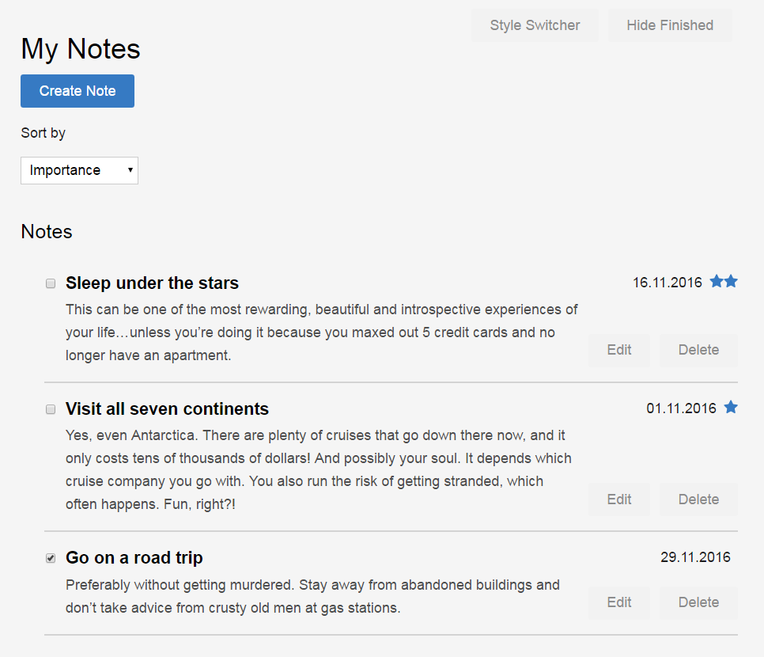

#My  Notes
HSR FEE project1

## Installing the app

_Prerequisite: [Node.js](https://nodejs.org) must be installed._

run `npm install` to install the dependencies.

## Starting the app

Starting the server:
Run `npm start` within the directory of the app. The server will listen on http://localhost:3002.

Starting the client:
open http://localhost:3002
